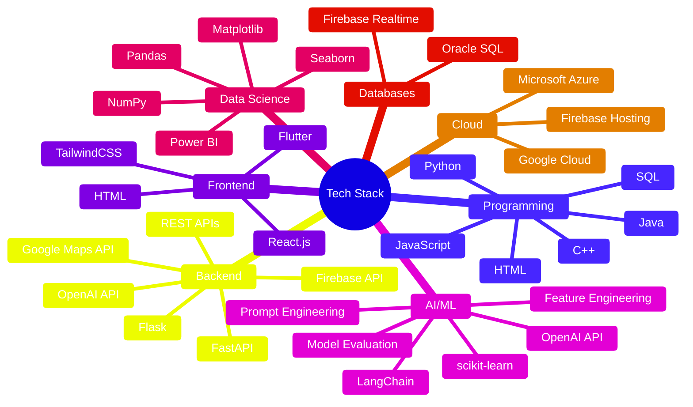

  

**Computer Engineering Graduate** • **American University of Sharjah (AUS)**

  
  
  

---

## 🚀 What I Do

I design and build **innovative, intelligent systems** that blend **robust backend logic**, **intuitive frontend experiences**, and **applied machine learning** to deliver impactful, end-to-end solutions.

- 🔄 **Full Software Development Lifecycle (SDLC):** From requirements analysis and system design to implementation, testing, and deployment
- 🤖 **AI System Integration & RAG Workflows:** Build context-aware intelligent systems using LLM integration, prompt engineering, retrieval-augmented generation (RAG), grounding strategies, and LangChain-based orchestration.
- 💻 **Full-Stack Development:** Build scalable web applications using modern frameworks, RESTful APIs, and cloud technologies  
- 📊 **Machine Learning & Data Science:** Perform model training, data preprocessing, and feature engineering to extract actionable insights 

---

## 💼 Project Portfolio

Welcome to my GitHub! Here you'll find my **project folders**, each highlighting a chapter of my journey across **software engineering**, **AI systems**, and **data science**. 

Click below to explore 👇

<b>🗂️ Software Engineering Projects</b>

#### 🧠 **COMPAIR** | [View Project →](https://github.com/wardacoder/COMPAIR)
A full-stack comparison web application built with React.js and FastAPI, featuring AI integration through LangChain and OpenAI API for intelligent, structured comparisons. It combines robust frontend and backend engineering, API design, testing, and prompt-driven AI reasoning into a cohesive, reliable system.

#### ⚙️ **Automated Laundromat System** | [View Project →](https://github.com/wardacoder/Automated-Laundromat-System)
Software Engineering SDLC project covering requirements (FRs & NFRs), design and analysis (UML diagrams: Use Case, Class, Domain Model, and Sequence), full-stack implementation (Firebase backend database and hosting + Flutter frontend), testing (plans and cases), and deployment of a smart laundromat web system.

#### 🚗 **Smart Toll Gate System** | [View Project →](https://github.com/wardacoder/Smart-Toll-Gate-System)
An automated Smart Toll Gate System built using Raspberry Pi, integrating sensors and RFID for vehicle detection and identification, along with speed and weight measurement for dynamic toll calculation. The system controls gate access, uploads data to ThingSpeak for cloud monitoring, and supports operator overrides and alert mechanisms. It also includes RESTful Flask APIs that enable web-based gate operations, real-time vehicle information, and trespassing event handling through defined routes.

#### ⚔️ **Multithreaded RPG Engine with Design Patterns & Sensor Integration** | [View Project →](https://github.com/wardacoder/Multithreaded-Design_Patterns-RPG)
Java-based multithreaded RPG engine showcasing professional software architecture with advanced objected oriented programming. Implements six software design patterns Observer, Singleton, Template Method, Strategy, State, and Command. Uses concurrent threads for battle timing and real-time gyroscope, accelerometer, and sound input with synchronized, thread-safe execution.

#### 🌤️ **AI & IoT Based Air Quality Monitoring and Prediction** | [View Project →](https://medium.com/@wardaulhasan/building-a-smart-solar-powered-aiot-system-for-real-time-air-quality-monitoring-and-prediction-a2449d4009d8)
Full-stack AIoT engineering project integrating embedded hardware, cloud infrastructure, and machine learning for real-time air quality monitoring and forecasting. Developed solar-powered ESP32 sensor nodes, a Firebase–GCP cloud pipeline, and a Flutter dashboard for live data visualization and predictive analytics using a hybrid CNN–BiLSTM model.

<b>🗂️ AI & Machine Learning Projects</b>

#### 🧠 **COMPAIR – AI-Powered Comparison Web Application** | [View Project →](https://github.com/wardacoder/COMPAIR)
Full-stack AI system built with FastAPI, React.js, LangChain, and OpenAI GPT-4o for structured, context-aware comparisons across multiple categories. Integrates multi-layered prompt design with dynamic personalization, category-grounded reasoning to filter invalid inputs, and schema-validated JSON outputs to ensure reliable, explainable AI responses.

#### 🌊 **Semi-Supervised Learning Framework for Flood Prediction** | [View Project →](https://github.com/wardacoder/Semi-Supervised-ML-Framework_For_Flood_Prediction)
Semi-supervised machine learning framework for datasets with limited labels, demonstrating applied AI/ML and data science skills in predictive modeling. Includes rigorous data preprocessing, selective pseudo-labeling, and a three-phase training workflow, achieving strong result of test F1 = 0.9986, surpassing published benchmarks

#### 🧬 **Using Machine Learning to Predict Protein Stability** | [View Project →](https://github.com/wardacoder/Flood-Prediction-ML)
Developed a supervised learning framework to predict protein stability upon single-point mutations using thermodynamic data derived from trypsin and chymotrypsin experiments. Implemented KNN, SVM, Decision Tree, and Naïve Bayes models with a rigorous pipeline including outlier removal (Z-score), standardization, class rebalancing (hybrid over- and undersampling), feature selection (SelectKBest), and dimensionality reduction (PCA). Performed 10-fold cross-validation and hyperparameter tuning across models, achieving strong generalization and robust predictive accuracy. Evaluated performance using F1-score, precision, recall, confusion matrix, and AUC-ROC curves to ensure stability predictions were reliable across all mutation classes

<!-- 

<b>🗂️ Data Science Projects</b>

Projects focused on **extracting insights**, **analyzing trends**, and **visualizing model performance**.

**Tools:** Python, Pandas, NumPy, Matplotlib, Seaborn, Power BI

-->
---

## 🛠️ Tech Stack

📋 <b>Detailed Skills Breakdown</b>

### Programming Languages
`Python` `Java` `C++` `JavaScript` `SQL` `HTML`

### Backend Development
`FastAPI` `Flask` `REST APIs` `OpenAI API` `Firebase API` `Google Maps API`

### Frontend Development
`React.js` `Flutter` `HTML` `TailwindCSS`

### Artificial Intelligence & Machine Learning
- **Frameworks:** `scikit-learn` `LangChain` `OpenAI API`
- **Techniques:** Supervised & Unsupervised Learning, Feature Engineering, Dimensionality Reduction (PCA), Model Evaluation (AUC, ROC), Hyperparameter Tuning, Prompt Engineering

### Data Science & Visualization
`Matplotlib` `Seaborn` `Power BI`

### Databases
`SQL (Oracle)` `NoSQL (Firebase Realtime Database)`

### Cloud Platforms
`Google Cloud Platform (GCP)` `Firebase Hosting` `Microsoft Azure`

---

## 💼 Current Focus

> 🔨 **Enhancing COMPAIR** — Expanding capabilities with improved grounding, structured output design, and cloud deployment
> 
> *Combining my interests in full-stack engineering and AI systems engineering*

---

## 🤝 Let's Connect!

### Open to Collaborations & Opportunities  

I’m always excited to connect around:  

-  **Software Engineering** and scalable system design  
-  **Full-Stack Development** using modern frameworks  
-  **AI/ML-driven applications** and intelligent automation  
-  **Cloud-based architectures** and deployment solutions  
-  **Data Science projects** focused on meaningful insights  

  
  
  

---

  

