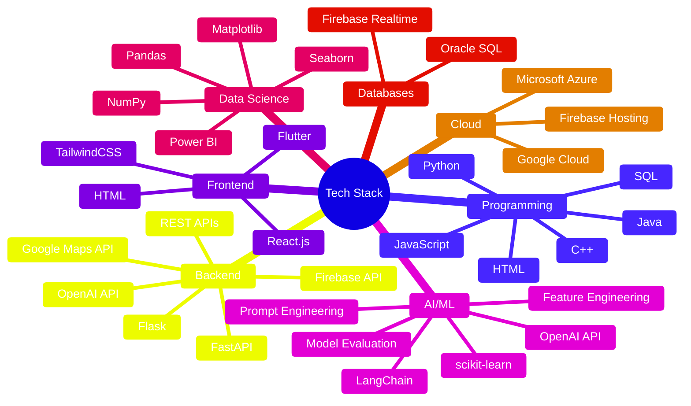

  

**Computer Engineering Graduate** • **American University of Sharjah (AUS)**

  
  
  

---

## 🚀 What I Do

I design and build **innovative, intelligent systems** that blend **robust backend logic**, **intuitive frontend experiences**, and **applied machine learning** to deliver impactful, end-to-end solutions.

- 🔄 **Full Software Development Lifecycle (SDLC):** From requirements analysis and system design to implementation, testing, and deployment  
- 💻 **Full-Stack Development:** Build scalable web applications using modern frameworks, RESTful APIs, and cloud technologies  
- 🤖 **AI System Integration:** Implement OpenAI API, prompt engineering, grounding techniques, and LangChain for intelligent automation  
- 📊 **Machine Learning & Data Science:** Perform model training, data preprocessing, and feature engineering to extract actionable insights 

---

## 💼 Project Portfolio

Welcome to my GitHub! Here you'll find my **project folders**, each highlighting a chapter of my journey across **software engineering**, **AI systems**, and **data science**. Click below to explore 👇

<b>🗂️ Software Engineering Projects</b>

#### 🧠 **COMPAIR** | [View Project →](https://github.com/wardacoder/COMPAIR)
A full-stack comparison web application built with React.js and FastAPI, featuring AI integration through LangChain and OpenAI API for intelligent, structured comparisons. It combines robust frontend and backend engineering, API design, testing, and prompt-driven AI reasoning into a cohesive, reliable system.

#### ⚙️ **Automated Laundromat System** | [View Project →](https://github.com/wardacoder/Automated-Laundromat-System)
Software Engineering SDLC project covering requirements (FRs & NFRs), design and analysis (UML diagrams: Use Case, Class, Domain Model, and Sequence), full-stack implementation (Firebase backend database and hosting + Flutter frontend), testing (plans and cases), and deployment of a smart laundromat web system.

#### 🚗 **Smart Toll Gate System** | [View Project →](https://github.com/wardacoder/Smart-Toll-Gate-System)
Automated Smart Toll Gate System that detects vehicles using sensors, identifies them via RFID and optional license plate recognition, measures speed and weight, calculates toll fees, controls gate access, uploads data to ThingSpeak for cloud monitoring, and provides alerts and operator override options. 

<b>🗂️ AI & Machine Learning Projects</b>

#### 🧩 **COMPAIR – AI Integration**
> Advanced prompt engineering and API integration within COMPAIR
- **Tech:** OpenAI API, LangChain
- **Focus:** Prompt templates, grounding strategies, minimizing hallucinations
- [View Project →](https://github.com/wardacoder/COMPAIR)

#### 🌊 **Flood Prediction System**
> Machine learning model predicting flood likelihood using real-world data
- **Tech:** Python, scikit-learn, semi-supervised learning (KNN with pseudo-labeling)
- **Focus:** Data preprocessing, feature selection, model evaluation (accuracy, precision, recall, F1-score)
- [View Project →](https://github.com/wardacoder/Flood-Prediction-ML)

#### 🧬 **Protein Stability Prediction**
> Predicting protein stability using ensemble methods
- **Tech:** Random Forest, PCA for dimensionality reduction
- **Focus:** Data analysis, training, visualization with Matplotlib and Seaborn

<b>🗂️ Data Science Projects</b>

Projects focused on **extracting insights**, **analyzing trends**, and **visualizing model performance**.

**Tools:** Python, Pandas, NumPy, Matplotlib, Seaborn, Power BI

---

## 🛠️ Tech Stack

📋 <b>Detailed Skills Breakdown</b>

### Programming Languages
`Python` `Java` `C++` `JavaScript` `SQL` `HTML`

### Backend Development
`FastAPI` `Flask` `REST APIs` `OpenAI API` `Firebase API` `Google Maps API`

### Frontend Development
`React.js` `Flutter` `HTML` `TailwindCSS`

### Artificial Intelligence & Machine Learning
- **Frameworks:** `scikit-learn` `LangChain` `OpenAI API`
- **Techniques:** Supervised & Unsupervised Learning, Feature Engineering, Dimensionality Reduction (PCA), Model Evaluation (AUC, ROC), Hyperparameter Tuning, Prompt Engineering

### Data Science & Visualization
`Matplotlib` `Seaborn` `Power BI`

### Databases
`SQL (Oracle)` `NoSQL (Firebase Realtime Database)`

### Cloud Platforms
`Google Cloud Platform (GCP)` `Firebase Hosting` `Microsoft Azure`

---

## 💼 Current Focus

> 🔨 **Enhancing COMPAIR** — Expanding capabilities with improved grounding, structured output design, and cloud deployment
> 
> *Combining my interests in full-stack engineering and AI systems engineering*

---

## 🤝 Let's Connect!

### Open to Collaborations & Opportunities  

I’m always excited to connect around:  

-  **Software Engineering** and scalable system design  
-  **Full-Stack Development** using modern frameworks  
-  **AI/ML-driven applications** and intelligent automation  
-  **Cloud-based architectures** and deployment solutions  
-  **Data Science projects** focused on meaningful insights  

  
  
  

---

  

